# Generic-BASIC-code
BASIC code which can be used with more then one BASIC dialect

## Lissajou in text format

Text is printed to display in complete lines. The code does not move the text cursor to specific locations. This also avoids differences in BASIC dialects.

The program has to work out which x values are part of the lissajou curve for each successive y value (or line to be send)

lissajou with two relative freq. and a phase shift

    x(t) = x_ampl * cos(fx * t)
    y(t) = y_ampl * sin(fy * t + phase)

Calculating parameter t values at given y
 
    sin(fy * t + phase) = y(t) / y_ampl
    => fy * t1 + phase = asin(y(t) / y_ampl) + k * 2 * pi
    => t1 = 1/fy * ( asin(y(t) / y_ampl) + k * 2 * pi - phase ) 
    => fy * t2 + phase = pi - asin(y(t) / y_ampl) - k * 2 * pi = pi * (1 - 2 * k) - asin(y(t) / y_ampl)
    => t2 = 1/fy * ( - asin(y(t) / y_ampl) + (1 - 2 * k) * pi - phase )

Parameter t values at given y, k is an integer number

    t1(y, k) = 1/fy * ( asin(y(t) / y_ampl) + k * 2 * pi - phase )
    t2(y, k) = 1/fy * ( - asin(y(t) / y_ampl) + (1 - 2 * k) * pi - phase )

The code: [lissa.bas](lissa.bas)

<code>
10 REM text Lissajou       K Moerman 2026
15 PRINT "Lissajou on a text screen": CPI = 3.1415927#
20 FX% = 3: FY% = 5: REM hor. and vert. frequencies
30 P$ = "*": A$ = ".": REM symbols to use plot and axes
40 XA% = 37: YA% = 10: REM hor. and vert ampl. in char
45 PH = CPI / 4: REM phase shift y vs x
50 IF FX% > FY% THEN NK% = FX% ELSE NK% = FY%
60 FOR Y% = -YA% TO YA%
70 IF Y% <> 0 THEN GOTO 100
80 L$ = STRING$(2 * XA%, A$)
90 GOTO 110
100 L$ = STRING$(XA%, " ") + A$ + STRING$(XA% - 1, " ")
110 FOR K% = 0 TO NK% - 1
120 R = Y% / YA%: GOSUB 240
130 T = 1 / FY% * (AR + K% * 2 * CPI - PH)
140 GOSUB 290
150 MID$(L$, X%, 1) = P$
160 T = 1 / FY% * (-AR + (1 - 2 * K%) * CPI - PH)
170 GOSUB 290
180 MID$(L$, X%, 1) = P$
190 NEXT K%
200 PRINT L$
210 NEXT Y%
220 END
230 REM Inverse sine of R --> AR
240 IF ABS(R) < 1 THEN AR = ATN(R / SQR(1 - (R * R)))
250 IF R = 1 THEN AR = CPI / 2
260 IF R = -1 THEN AR = -CPI / 2
270 RETURN
280 REM calculate char position X% out of T
290 X% = INT(XA% * (1 + .96 * COS(FX% * T)) + .5)
300 RETURN
</code>

Running in QB64 Phoenix edition:

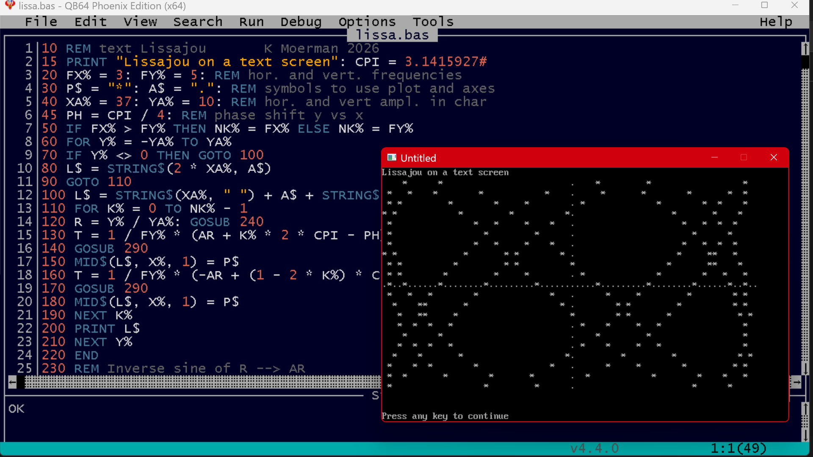

Running in PC BASIC:

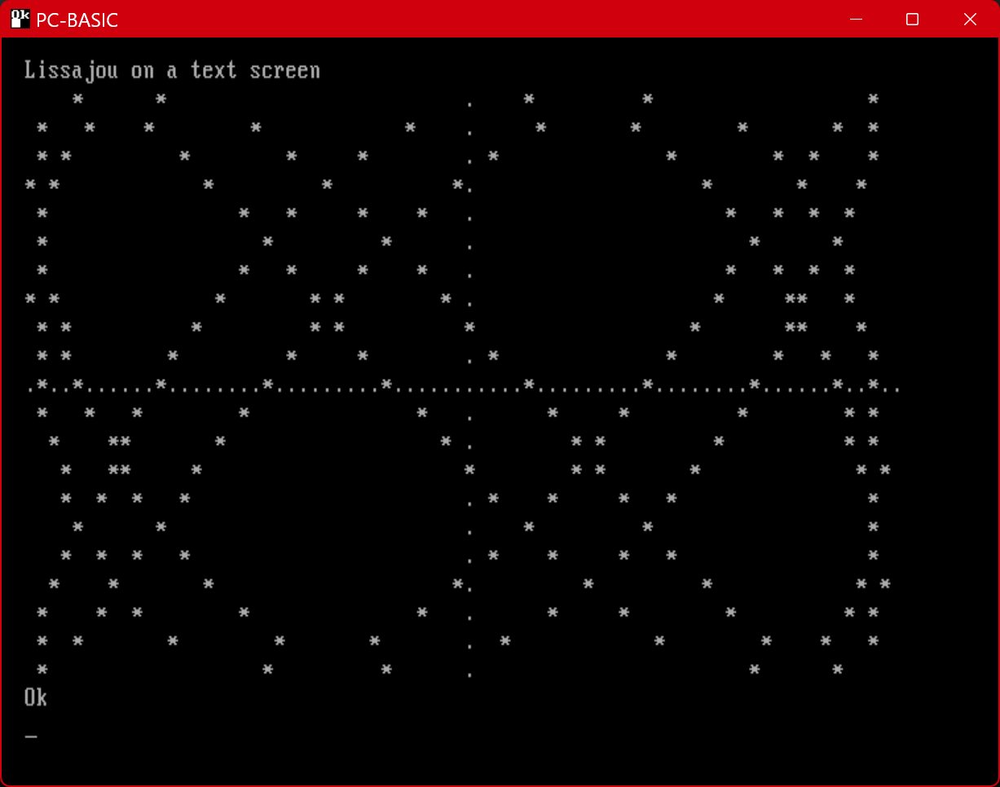

Running in BBC BASIC for SDL:

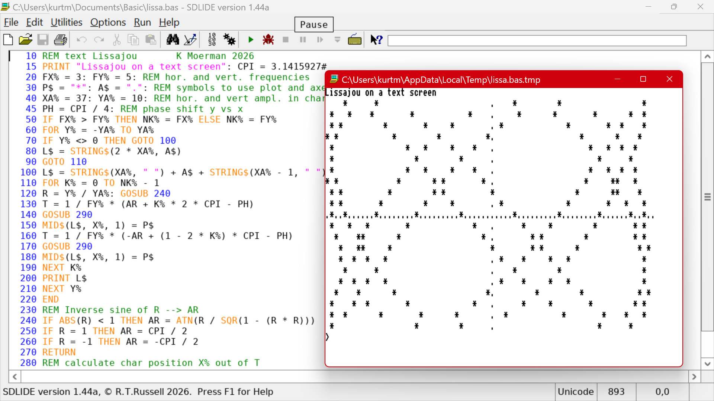

Running in [webmsx](https://webmsx.org/), an online emulator for 8 bit MSX BASIC:

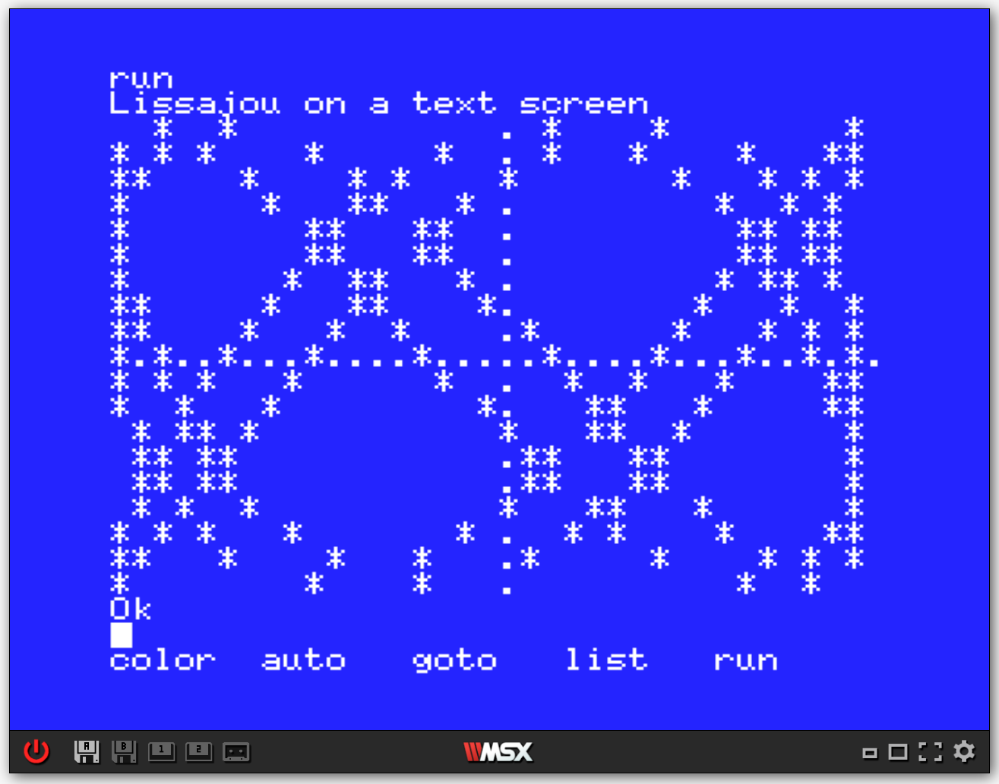

The values of XA% and YA% had to be reduced for MSX to fit the lissajou in the maximum text dimensions.

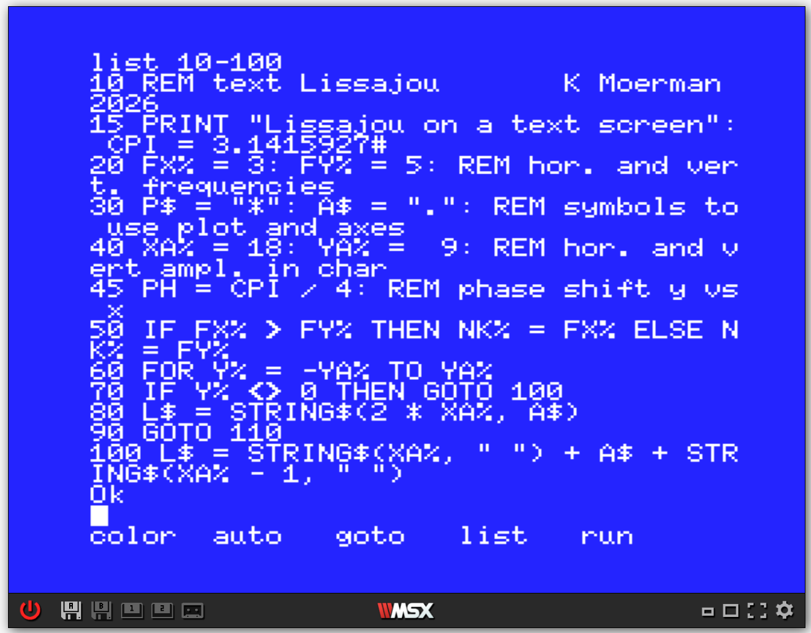

## Root finding using Brent's method 

This program searches for a root of an equation between a lower limit a and upper limit b. It uses Brent's method which switches between the bisection method, the secant method and inverse quadratic interpolation depending on which method is most appropriate.

There are no loop statements used such as WHILE or REPEAT UNTIL because the syntax and availability differs between BASIC dialects. (For example PC-BASIC (GW-BASIC) has no REPEAT..UNTIL, it does have WHILE..WEND. However BBC BASIC requires WHILE to be followed by ENDWHILE.)
Instead this program uses IF stetements combined with GOTO, so proper old school for the sake of compatibility.

The code: [bren.bas](bren.bas)

The program was tested with following BASIC systems:

* [PC-BASIC an GW BASIC emulator](https://robhagemans.github.io/pcbasic/)

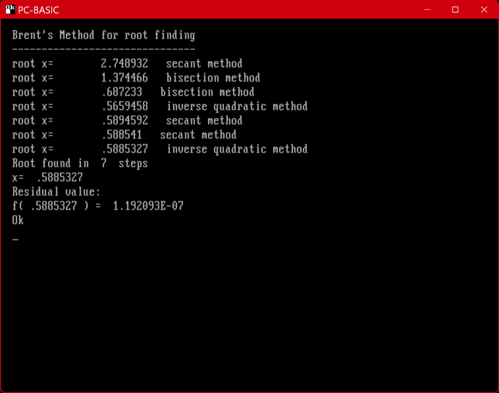

* [QB46 PE](https://www.qb64phoenix.com/)

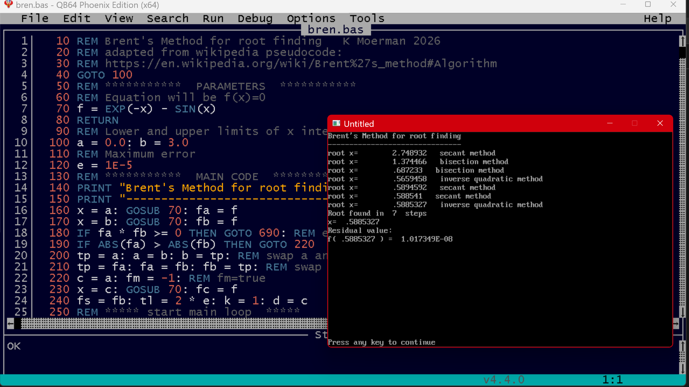

* [BBC BASIC for SDL](https://www.bbcbasic.co.uk/)

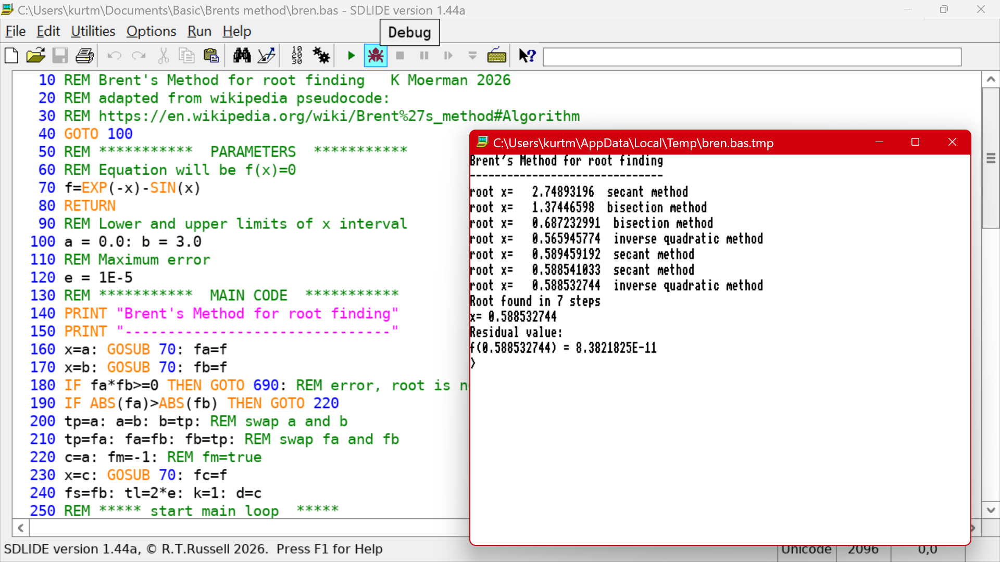

* [WebMSX an online MSXX BASIC emulator](https://webmsx.org/)

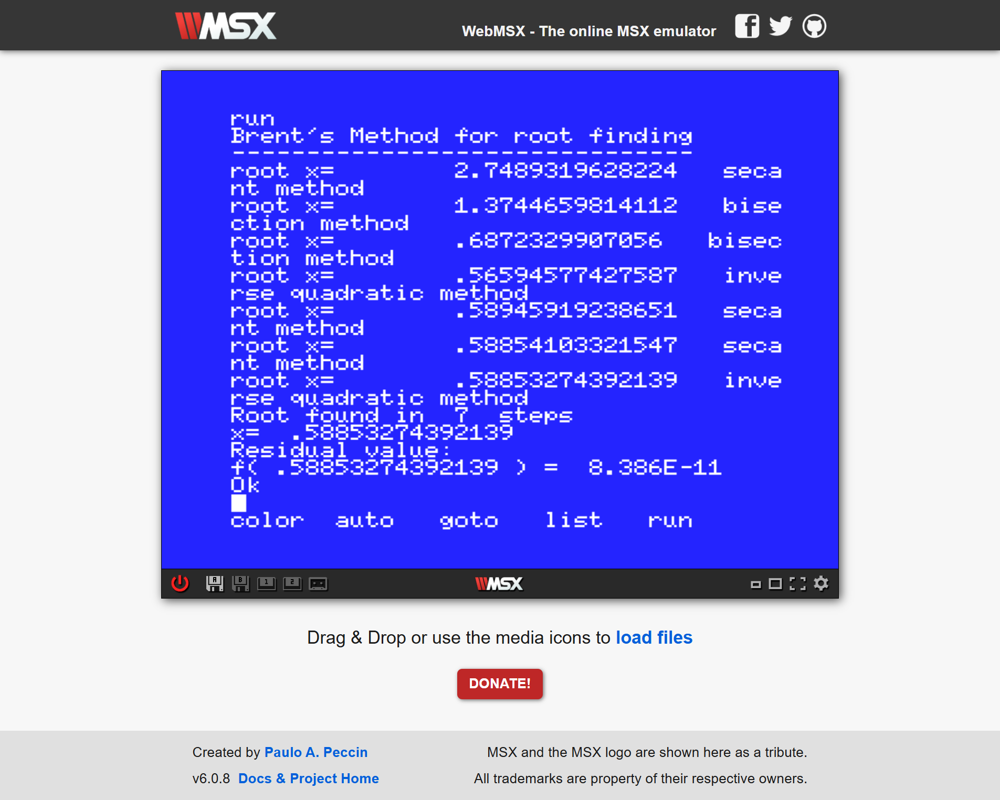

* [Applesoft Basic in Javascript](https://www.calormen.com/jsbasic/)

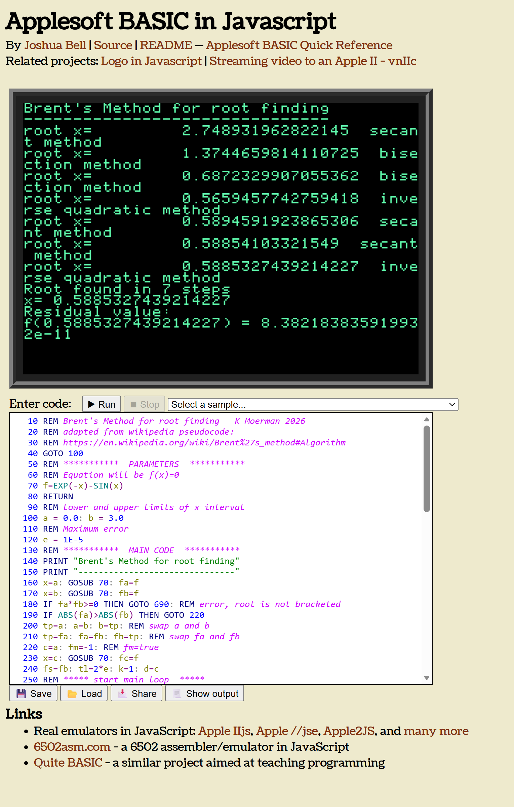

* [C64 BASIC emulator](https://stigc.dk/c64/basic/)

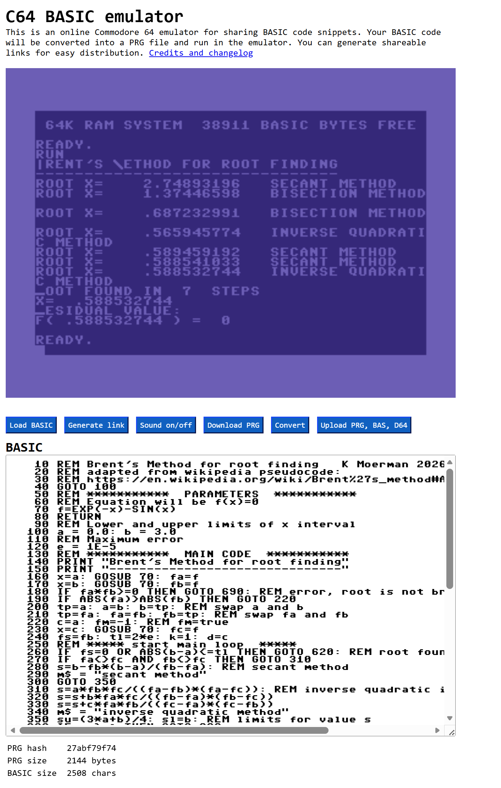
